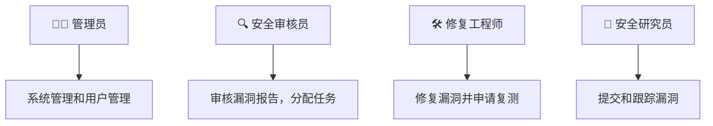
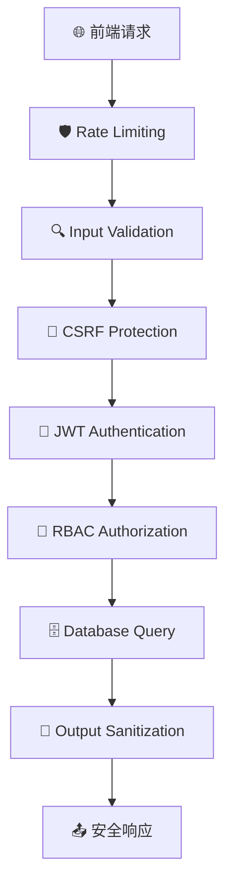

# 🔒 漏洞管理平台 (Vulnerability Management Platform)

<div align="center">


**一个专业的安全漏洞管理系统，支持完整的漏洞生命周期管理**

[🚀 快速开始](#-安装和运行) • [📖 API文档](#-api接口) • [🛡️ 安全特性](#-安全考虑) • [🤝 贡献指南](#-贡献指南)

</div>

---

## 🌟 功能特性

<table>
<tr>
<td width="50%">

### 🎯 核心功能
- **📝 漏洞提交** - 富文本编辑器，支持代码片段和图片
- **🔍 审核流程** - 多角色权限管理和状态跟踪  
- **🔧 修复管理** - 工程师修复状态和复测申请
- **👥 用户管理** - 基于角色的访问控制(RBAC)

</td>
<td width="50%">

### 🛡️ 安全特性
- **🚫 SQL注入防护** - Prisma ORM参数化查询
- **🔒 XSS防护** - 输入验证和输出转义
- **🛡️ CSRF保护** - 双重提交Cookie模式
- **📁 文件安全** - 深度内容检查和类型验证

</td>
</tr>
</table>

### 👤 用户角色



---

## 🚀 技术栈

<div align="center">

### 🎨 前端技术


### ⚙️ 后端技术


### 🛠️ 开发工具


</div>

---

## 🏗️ 项目架构

```
vnlu/
├── 🖥️  client/                 # Next.js 前端应用
│   ├── 📱 src/app/             # App Router 页面
│   ├── 🧩 components/          # 共享组件
│   └── 🔧 utils/               # 工具函数
├── 🔌 server/                  # Express.js 后端应用
│   ├── 🛤️  routes/             # API路由
│   ├── 🛡️  middleware/         # 安全中间件
│   ├── 🗄️  prisma/             # 数据库模式
│   └── 📂 uploads/             # 文件上传目录
└── 📦 package.json             # 项目配置
```

---

## 🚀 安装和运行

### ✅ 环境要求

<table>
<tr>
<td>

**必需环境**
- 🟢 Node.js 18+
- 📦 npm 或 yarn

</td>
<td>

**推荐配置**
- 💾 内存: 4GB+
- 💽 存储: 1GB+

</td>
</tr>
</table>

### 📥 快速开始

```bash
# 1️⃣ 克隆项目
git clone <repository-url>
cd vnlu

# 2️⃣ 安装依赖
npm install

# 3️⃣ 数据库初始化
cd server
npx prisma migrate dev
npx prisma generate

# 4️⃣ 启动开发服务器
cd ..
npm run dev
```

### 🔧 环境配置

<details>
<summary>📝 点击展开配置详情</summary>

#### 客户端配置 `client/.env.local`
```env
NEXT_PUBLIC_API_URL=http://localhost:3001
```

#### 服务端配置 `server/.env`
```env
DATABASE_URL="file:./dev.db"
JWT_SECRET="your-super-secret-jwt-key-here"
UPLOAD_DIR="./uploads"
NODE_ENV="development"
```

</details>

### 🌐 访问地址

| 服务 | 地址 | 说明 |
|------|------|------|
| 🖥️ 前端界面 | http://localhost:3000 | 用户界面 |
| 🔌 API服务 | http://localhost:3001 | 后端接口 |

---

## 📚 API接口

### 🔐 认证模块
| 方法 | 端点 | 描述 |
|------|------|------|
| `POST` | `/api/auth/login` | 🔑 用户登录 |
| `POST` | `/api/auth/register` | 📝 用户注册 |
| `POST` | `/api/auth/logout` | 🚪 用户登出 |

### 🐛 漏洞管理
| 方法 | 端点 | 描述 |
|------|------|------|
| `GET` | `/api/vulnerabilities` | 📋 获取漏洞列表 |
| `POST` | `/api/vulnerabilities` | ➕ 提交新漏洞 |
| `GET` | `/api/vulnerabilities/:id` | 👁️ 获取漏洞详情 |
| `PATCH` | `/api/vulnerabilities/:id` | ✏️ 更新漏洞状态 |
| `POST` | `/api/vulnerabilities/:id/review` | ✅ 审核漏洞 |

### 👥 用户管理
| 方法 | 端点 | 描述 |
|------|------|------|
| `GET` | `/api/users` | 👨‍👩‍👧‍👦 获取用户列表 |
| `PATCH` | `/api/users/:id` | ✏️ 更新用户信息 |

### 📁 文件上传
| 方法 | 端点 | 描述 |
|------|------|------|
| `POST` | `/api/upload/image` | ⬆️ 上传图片 |
| `DELETE` | `/api/upload/image/:filename` | 🗑️ 删除图片 |

---

## 🛡️ 安全考虑

<div align="center">

### 🔒 多层安全防护



</div>

#### ✅ 输入验证
- 🔍 **严格验证** - 所有用户输入都经过验证和清理
- 📝 **白名单模式** - 只允许预定义的文件类型
- 🔬 **深度检查** - 文件内容和头部验证

#### 🔐 访问控制  
- 🎫 **JWT认证** - 基于令牌的身份认证
- 🎯 **细粒度权限** - 基于角色的访问控制
- 🚫 **越权防护** - 防止垂直和水平越权

#### 🛡️ 数据保护
- 🤐 **敏感信息** - 不记录敏感数据到日志
- 📁 **路径隔离** - 文件上传路径安全隔离
- 🔒 **HTTPS强制** - 生产环境强制加密传输

---

## 👨‍💻 开发指南

<details>
<summary>🔧 开发工作流</summary>

### 📄 添加新页面
```bash
# 1. 创建页面目录
mkdir client/src/app/new-feature

# 2. 添加页面组件
touch client/src/app/new-feature/page.tsx

# 3. 配置路由权限
# 在相应的布局文件中添加权限检查
```

### 🔌 添加新API
```bash
# 1. 创建路由文件
touch server/src/routes/new-feature.ts

# 2. 添加中间件
# 认证、验证、权限检查

# 3. 注册路由
# 在 server/src/index.ts 中添加
```

### 🗄️ 数据库变更
```bash
# 1. 修改数据库模式
vim server/prisma/schema.prisma

# 2. 生成迁移文件
npx prisma migrate dev --name feature_name

# 3. 更新类型定义
npx prisma generate
```

</details>

---

## 🚀 生产部署

### 🌍 环境配置

<table>
<tr>
<td width="50%">

**🔒 安全配置**
- 🔑 强JWT密钥
- 🌐 HTTPS配置
- 🛡️ CORS策略
- 🏗️ 反向代理

</td>
<td width="50%">

**📊 性能优化**
- 🗄️ 数据库优化
- 📁 静态资源CDN
- 💾 Redis缓存
- 📈 监控告警

</td>
</tr>
</table>

### ⚡ 快速部署

```bash
# 🐳 Docker 部署
docker-compose up -d

# 📦 手动部署
npm run build
npm start
```

---

## ❓ 故障排除

<details>
<summary>🔧 常见问题解决</summary>

### 🚫 端口冲突
```bash
# 检查端口占用
lsof -i :3000
lsof -i :3001

# 修改端口配置
vim client/.env.local
vim server/.env
```

### 🗄️ 数据库问题
```bash
# 重置数据库
npx prisma migrate reset

# 查看数据库状态
npx prisma studio
```

### 📁 文件上传问题
```bash
# 检查目录权限
ls -la server/uploads/

# 创建上传目录
mkdir -p server/uploads
chmod 755 server/uploads
```

</details>

---

## 🤝 贡献指南

<div align="center">

### 🌟 欢迎贡献！

[](CODE_OF_CONDUCT.md)

</div>

```bash
# 1️⃣ Fork 项目
git fork

# 2️⃣ 创建功能分支
git checkout -b feature/amazing-feature

# 3️⃣ 提交更改
git commit -m '✨ Add amazing feature'

# 4️⃣ 推送分支
git push origin feature/amazing-feature

# 5️⃣ 创建 Pull Request
```

### 📋 贡献类型

| 类型 | 说明 | 示例 |
|------|------|------|
| 🐛 Bug修复 | 修复已知问题 | `🐛 Fix login redirect issue` |
| ✨ 新功能 | 添加新特性 | `✨ Add export functionality` |
| 📝 文档 | 改进文档 | `📝 Update API documentation` |
| 🎨 样式 | UI/UX改进 | `🎨 Improve mobile responsiveness` |
| ⚡ 性能 | 性能优化 | `⚡ Optimize database queries` |

---

## 📄 许可证

<div align="center">


本项目采用 [MIT 许可证](LICENSE) - 查看文件了解详情

</div>

---

## 📞 联系方式

<div align="center">

**有问题或建议？我们很乐意听到您的声音！**

[](../../issues)
[](mailto:your-email@example.com)

</div>

---

<div align="center">

### ⭐ 如果这个项目对您有帮助，请给我们一个星标！

[](../../stargazers)
[](../../network/members)

---

**⚠️ 免责声明**: 本项目仅用于学习和测试目的。在生产环境中使用前，请进行充分的安全测试和代码审查。

</div>